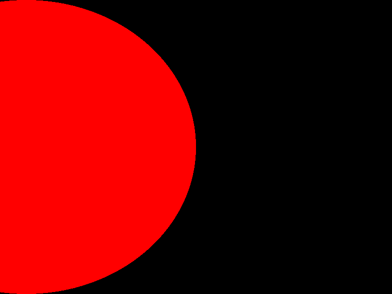
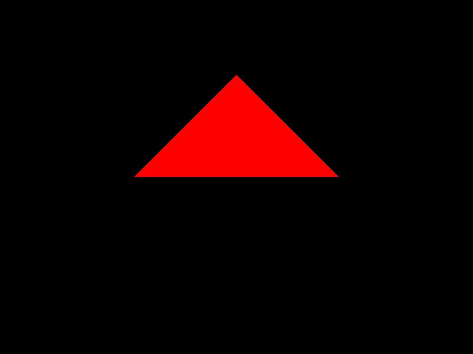
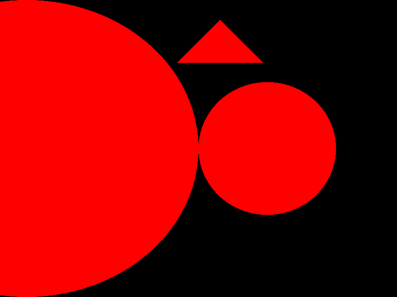
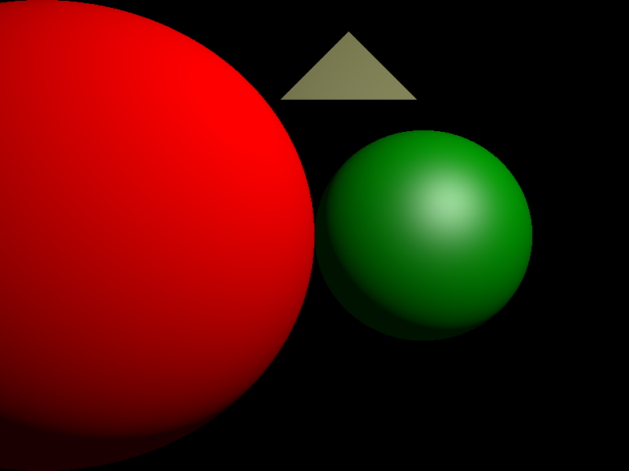
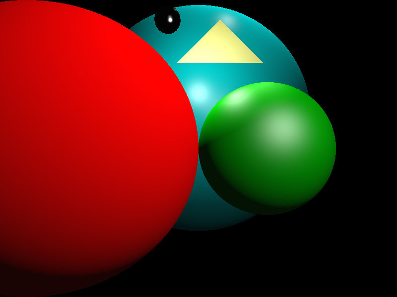
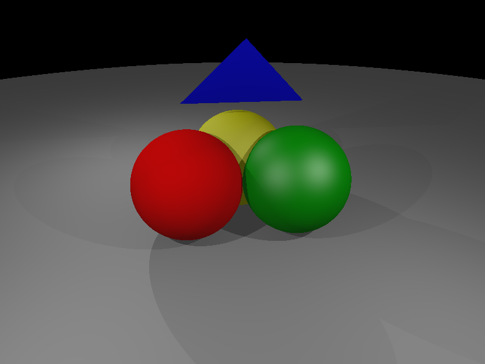
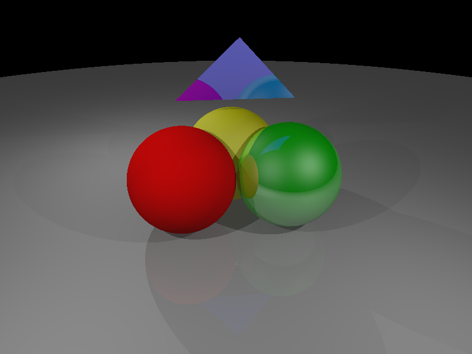
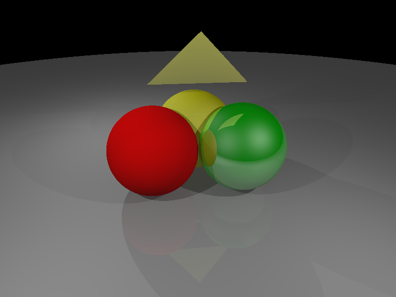
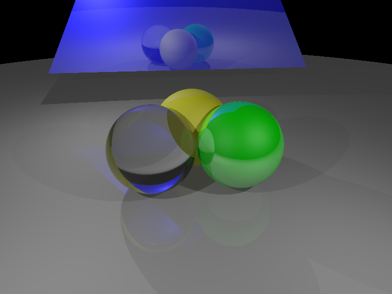

# Ray Tracer - Stephen  Pasch
### COMS 4160 : Computer Graphics

Written September-November of 2023

In COMS 4160 we write, test, and evaluate a ray tracing renderer named `Olio`. Over the course of the semester, the renderer evolves more features. I have ordered this documentation chronologically with the advancements of the progress. 

**Disclaimer:** This is not standalone runnable code. I have included this in the portfolio as a proof to my understanding of ray tracing methodology and competetency in c++. The pieces I have included are only that which I have written myself/are essential to the understanding of code that I have written(ex. provided header files for classes I implement.) Each file will be marked with an author for clarity. I do not wish to take credit for work that is not mine.

In this README I give an overview of the entierty of the process at a higher level. But more detail for the different sections is given in `Project-Breifs/README_HWX_TITLE.md`. 

# Theme 1: Ray Tracing Framework

We begin by implementing only the most basic functionality:
* Scene file read (parser template provided)
* Camera & image setup
* Primary ray generation
* Ray/sphere and ray/triangle intersection (note: we begin by only considering a single sphere or triangle in the scene)
* Image write
* no: shading,lights, etc...yet...

The `Olio` executable reads in the scene file, build the camera model and sets up the image, and generates rays -- 1 for each pixel.  For any pixel, if there is a ray-sphere or ray-triangle intersection, the color for that pixel should be red (i.e. [1 0 0]). If there is no intersection, the color of that pixel should be black (i.e. [0 0 0]). After rendering all the pixels, the image file should be saved and the program should exit.

Example Scenes can be found in the folder `Input-Scenes`

To parse a scene and render an image, Olio should be run with:
```
./src/rtbasic/olio_rtbasic -s <scene_file> -o <output_image>
```

## 1. Vector3 class 
The Vector class is in `Code/vector.{h,cc}`

We first implemented a Vector class that supports 3-component vectors. Vectors such as this are used frequently in our ray calculations. Standard function set.(Multiplication/division, dot product, cross product, etc.) Further detail are provided in  `Project-Breifs/README_HW1_VECTORS.md`

## 2. Ray and HitRecord classes
Implemented the `Ray` and `HitRecord` classes in `Code/ray.{h.cc}`.

**Ray**: A general class for a Ray. A construct a with an `origin`, and `direction`.

**HitRecord**: A hit record is a log of information collected at in imapact between a ray and a surface. A hit record holds `point`, the hit point, `normal`, the surface normal at the hit point, `t`, the fractional distance along the ray an impact is, and `front_face_`,  a boolean  describing whether the surface is front or backfacing.


## 3. Sphere class
The `Sphere` class is in `Code/geometry/sphere.{h,cc}`.

Surface Class Describing a Sphere. More info in `Project-Breifs/README_HW2_RAYTRACING.md`.


## 4. Triangle class
The `Triangle` class is in `Code/geometry/triangle.{h,cc}`.

Surface Class Describing a Triangle. More info in `Project-Breifs/README_HW2_RAYTRACING.md`.

## 5. Camera class
The `Camera` class is in `Code/camera/camera.{h,cc}`.

The `Camera` Class sets our 'eye' for the ray tracer. Can set and change FOV and aspect ratio. As well as run updates the viewport as any of these things change. More info in `Code/camera/camera.h`.


## 6. RayTracer class
The `RayTracer` class is in `Code/renderer/raytracer.{h,cc}`.

Here we define `RayColor()` and `Render()`.

RayColor : Determines the color of each ray at its intersection point. It calculates this with recursive ray tracing to create diffuse, specular, shadow, reflective, and refractive effects of the material it interacts with. 

## Basic Ray Tracer Output
These inital renders of the naiive ray tracer allow us to recover shape a single shape that is in a scene(will be extended later). 


Figure 1: Output of running scene (`Intput-Scenes/No-Shading/sphere_test.scn`) We see that the sphere here is partially our of frame.


Figure 2: Output of running scene (`Intput-Scenes/No-Shading/triangle_test.scn`)

## Theme 2: Shading (Phong Shading)
We next extend the renderer so that it computes some reasonable shading model for each intersection point on the surface (sphere or triangle). We  use the Blinn-Phong model and extend to handle multiple spheres and triangles in the scene.

Now, the code will not only have to see if the ray through a pixel intersects a surface, but it must determine *which* of the possible intersections is the closest. And for that closest intersection, retain the HitRecord information. We then compute the Blinn-Phong shading at the intersection point and use that value for the image RGB value (instead of just red as we did before.)

The information we use to compute the Blinn-Phong shading is:
* the surface normal at the (closest) intersection point
* the normalized vector from the intersection point to the light
* the normalized vector that is opposite the camera ray direction vector
* the energy coming from the light source
* the diffuse & specular coefficients of the material, and its Phong exponent

From these values, you can compute the diffuse contribution and specular contribution to the shading at the intersection point. Add them together to get the result.

We extend the parser to recognize material definitions and assign them to each geometric primitive. The parser will also read in any light defined in the scene file to use in lighting calculations. 

## 7. SurfaceList class 

The new `SurfaceList` class in `Code/geometry/surface_list.{h,cc}` 

Describes a list of hittable surfaces so that we can include more objects in our scene. More info in `Project-Breifs/README_HW3_SHADING.md`.


## 8. Scene Parser
Note: see `raytra_scene_file_format.pdf` in the Pages section of CourseWorks for a description of the scene file

The scene parser is in `Code/parser/raytra_parser.{h,cc}`

This class contains the functions to parse a scene file and create the appropriate Surfaces, Materials,  Camera, and Lighting in the scene. It now supports loading multiple surfaces. As we define more complex materials we extend this parser to handle them.

You can test your implementation so far with this scene: `data/scenes/multiple_surfaces_no_mat.scn` Your rendered image should look like this:


Figure 3: Result of rendering `Input-scenes/multiple_surfaces_no_mat.scn`

## 10. Point and Ambient Lights 

We define the `PointLight` and `AmbientLight` classes in `Code/light/light.{h,cc}`. 

They are both subclasses of the `Light` class, which came implemented in the template.

The light classes store the intensity, position, and color of given light sources. As well as calculate the radiance at a given point with `Illuminate()`. More info in `Project-Breifs/README_HW3_SHADING.md` and `Code/light/light.h`

Note: We update the scene parser to accept light objects. We also extend the Ray Tracer Class to render proper lighting. More info in `Project-Breifs/README_HW3_SHADING.md`.

## 11. PhongMaterial Class
The `PhongMaterial` class is in `Code/material/phong_material.{h,cc}`

We only implement the `PhongMaterial::Evaluate()` function which computes the Blinn-Phong diffuse and specular coefficients that will be used to attenuate the irradiance at the hit point in `PointLight::Illuminate()`.

## First shaded renders!


Figure 4: Result of rendering `Input-Scenes/multiple_surfaces_with_mat.scn`. We see here demonstrated diffuse shading.


Figure 5: Result of rendering `Input-Scenes/multiple_surfaces_with_mat_2.scn`. We see here demonstrated diffuse and specular shading.

# Theme 3: Reflection and Refraction

Through recursive ray tracing methods we will introduce reflection and refraction rays that will exend the renderer to more complex materials and shading effects. The ones we explore are shadows, mirrors, and glass-like materials. 

## Shadows

We extend the `Light::Illuminate()` function by using a ray starting from the hit point of the incident ray to the light source to see if there is an occluding object between the hit point and light. These 'shadow rays' allow us to negate contributions from light sources that are occulded and only summ contributions from each visible light source.


Figure 6: Result of rendering `Input-Scenes/three_spheres.scn`. We see true shadows demonstrated.

## True Reflections 

We adapt `RayTracer::RayColor()` to run recursivly to represent true specular reflections. More information in `Projecti-Breifs/README_HW4_GLASS_SHADOWS.md`


Figure 7: Result of rendering `Input-Scenes/three_spheres.scn`. We see true reflection demonstrated.

## Backfacing Materials

We implement a backside to materials: the "back" side of triangles get a special material that has only diffuse (zero specular) and its diffuse components are [1 1 0] (bright yellow). This change is made in `PhongMaterial::Evaluate()`. This allows us to debug geometry problems quicker.

With this addition, 


Figure 8: Rendering `Input-Scenes/three_spheres.scn` produces this image. We now see that the above triangle was facing away from the camera.

## Dielectrics

Because of the behavior of refraction, it is only implementable on closed volumes, and since the only closed objects you have implemented are spheres, limit yourself to that (later in the course, if you wish to extend it to other objects, you can try to then).

### Implementation details:

#### PhongDielectric class

We implement a new `PhongDielectric` material class. The class inherits `PhongMaterial` and implements a new `Scatter()` function, which will be called instead of PhongMaterial's `Evaluate()`. More information in `Code/material/PhongDielectric.h`

#### RayTracer
`RayTracer::RayColor()` is modified to detect and handle dielectric materials differently, calling `PhongDielectric::Scatter()` instead of `PhongMaterial::Evaluate()`.

#### Scene File Parser

We extend support for parsing dielectric Phong materials to the scene parser.

With these changes, rendering `data/scenes/three_spheres_glass.scn` should produce this image:


Figure 9: Result of rendering `Input-Scenes/three_spheres_glass.scn`. We can see the dielectric sphere on the left exhibit properties of reflection and refraction. 
